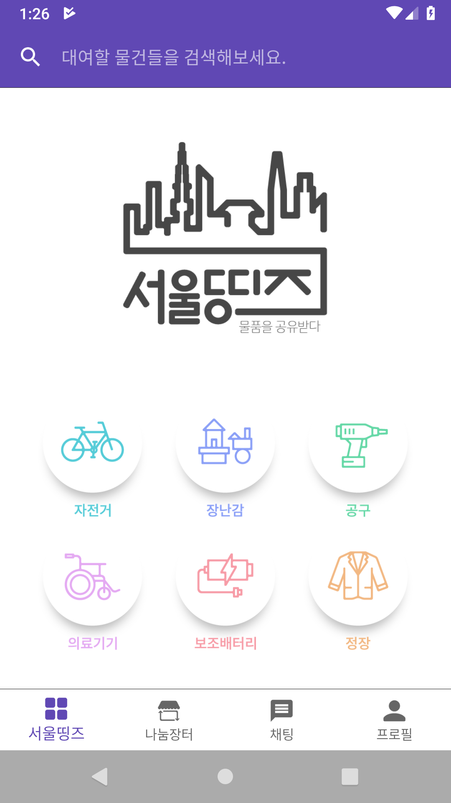
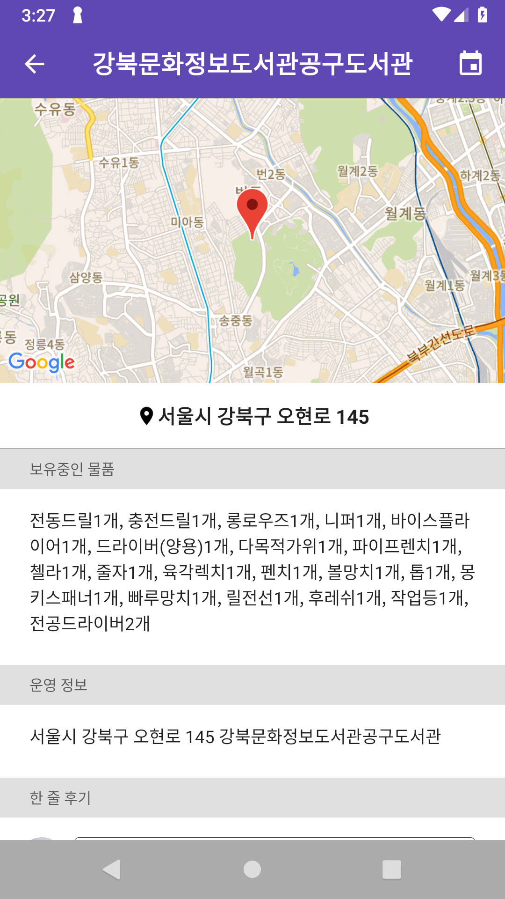
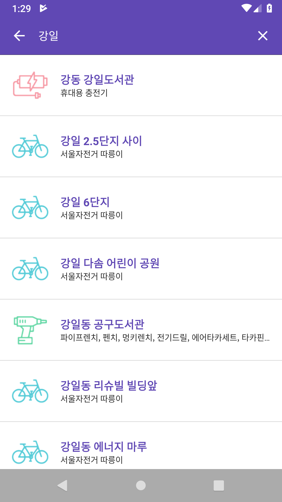
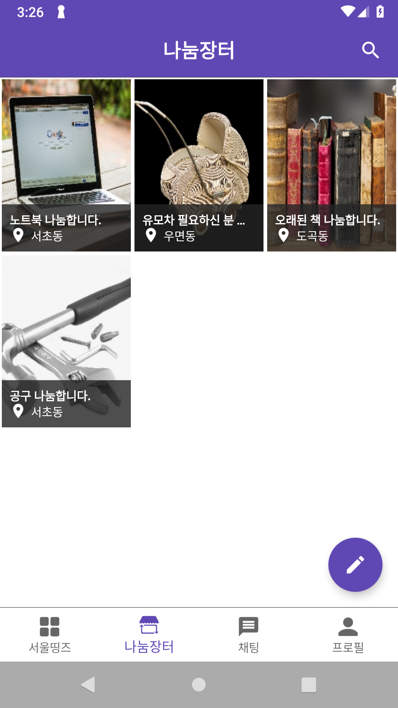
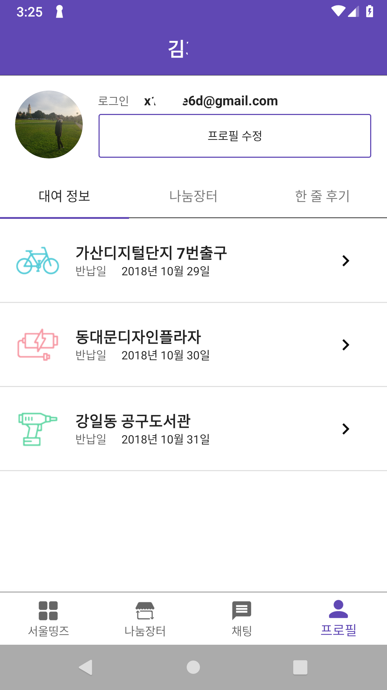

# seoulthings-android


2018년 서울시 앱 공모전 발전상 수상작 "서울띵즈" 안드로이드 어플리케이션

## 서울띵즈란?

[](https://youtu.be/2vK82zRi4Mg)
_클릭하면 YouTube에서 프로젝트 소개 동영상을 볼 수 있습니다._

서울시에서 제공하는 공유 물픔을 한 곳에서 찾아볼 수 있는 안드로이드 어플리케이션입니다.

장난감, 공구, 자전거, 의료기기, 보조 배터리, 정장 총 6가지의 공유 물품 데이터를 제공하며, 추가적으로
시민들이 자발적으로 공유할 수 있는 나눔장터가 있습니다.

서울띵즈는 물품의 일회성을 줄이고 재사용을 늘려 사회적 낭비를 최소화할 수 있을 것이라 기대합니다.


## 기능

서울띵즈의 주요 기능은 서울시에서 제공하는 공유 물품 데이터 제공 및 나눔장터 서비스입니다.

### 소셜 로그인

[Firebase 인증][1]으로 이메일 로그인 뿐만 아니라 구글 연동 로그인을 제공합니다.


### 공유 물품 데이터

공유 물품 데이터는 자전거, 장난감, 공구, 의료기기, 보조배터리, 정장 총 6가지를 제공합니다.

원하는 공유 물품을 쉽게 찾을 수 있도록, 카테고리 전체 검색, 카테고리 별 부분 검색을 제공합니다.
혹은, 카테고리에서 공유 물품 목록을 볼 수 있습니다.

목록의 각 항목을 클릭하면 공유 물품에 대한 자세한 정보를 볼 수 있으며, 대여일과 반납일을 설정할 수 있고
별점과 한 줄 후기로 의견공유를 가능하게 합니다.


### 나눔 장터

서울시에서 제공하는 공유 물품 뿐만 아니라 더 다양한 물품을 공유할 수 있도록 나눔장터를 제공합니다.

사용자는 자신에게 필요 없는 물건을 나눔하기 위해 나눔장터에 게시글을 작성할 수 있으며, 사진 첨부, 나눔
위치 설정 기능을 제공합니다. 특히, [Geocoding][2] 기능을 통해 지도상에서의 간단한 클릭 만으로 나눔
위치 주소를 쉽게 설정할 수 있습니다.

나눔 물품의 상세 페이지나 채팅 목록을 통해 사용할 수 있는 실시간 채팅 기능을 통해, 사용자는 자신의 개인
정보를 공개하지 않고도 다른 사용자들과 대화할 수 있도록 하였습니다.


## 스크린샷

<div style="display:flex;" >





</div>


## License

```
MIT License

Copyright (c) 2018-2019 Gihwan Kim

Permission is hereby granted, free of charge, to any person obtaining a copy
of this software and associated documentation files (the "Software"), to deal
in the Software without restriction, including without limitation the rights
to use, copy, modify, merge, publish, distribute, sublicense, and/or sell
copies of the Software, and to permit persons to whom the Software is
furnished to do so, subject to the following conditions:

The above copyright notice and this permission notice shall be included in all
copies or substantial portions of the Software.

THE SOFTWARE IS PROVIDED "AS IS", WITHOUT WARRANTY OF ANY KIND, EXPRESS OR
IMPLIED, INCLUDING BUT NOT LIMITED TO THE WARRANTIES OF MERCHANTABILITY,
FITNESS FOR A PARTICULAR PURPOSE AND NONINFRINGEMENT. IN NO EVENT SHALL THE
AUTHORS OR COPYRIGHT HOLDERS BE LIABLE FOR ANY CLAIM, DAMAGES OR OTHER
LIABILITY, WHETHER IN AN ACTION OF CONTRACT, TORT OR OTHERWISE, ARISING FROM,
OUT OF OR IN CONNECTION WITH THE SOFTWARE OR THE USE OR OTHER DEALINGS IN THE
SOFTWARE.
```

[1]: https://firebase.google.com/products/auth
[2]: https://developers.google.com/maps/documentation/geocoding